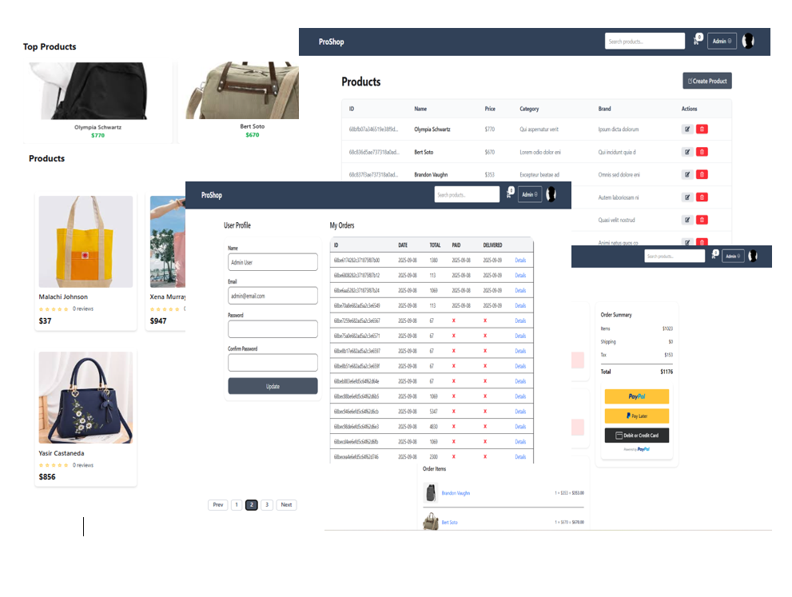

# ProShop eCommerce
ProShop – A full-featured eCommerce platform built with the MERN stack.
Includes shopping cart, product reviews & ratings, top product carousel, search & pagination, user profiles, admin management, order tracking, secure checkout with PayPal/credit card, Cloudinary image upload, and database seeding for quick setup.


##  Features
- Full featured shopping cart
- Product reviews and ratings
- Top products carousel
- Product search + pagination
- User profile with order history  
- WT Authentication & Protected Routes
- Admin product management
- Admin user management
- Admin Order details page
- Mark orders as delivered option
- Checkout process (shipping, payment method, etc)
- PayPal / credit card integration
- Database seeder (products & users)
- Image upload with **Cloudinary**  

##  Tech Stack
- Frontend: React 18 + Vite,Redux Toolkit + RTK Query,Axios,React Icons,TailwindCSS + DaisyUI
- Backend: Node.js, Express
- Database: MongoDB,Mongoose
## postman_collection
https://github.com/dipu-37/ProShop/blob/main/ProShop.postman_collection.json

## Installation Frontend
```bash
git https://github.com/dipu-37/ProShop.git
cd frontend
npm install
npm run dev
```
## Installation Backend
```bash
cd backend
npm install
npm run dev or start
```
##  Folder Structure
```
├── backend/ # Node.js + Express + MongoDB backend
│ ├── package.json # Backend dependencies
│ └── src/
│ └── app/
│ ├── config/ # Database configuration (MongoDB)
│ │ └── db.js
│ ├── controllers/ # Route controllers (business logic)
│ │ ├── authController.js
│ │ ├── orderController.js
│ │ ├── productControllers.js
│ │ └── userControllers.js
│ ├── data/ # Seeder data (products & users)
│ │ ├── products.js
│ │ └── user.js
│ ├── middleware/ # Middleware (auth, error handling)
│ │ ├── asyncHandler.js
│ │ ├── authMiddleware.js
│ │ └── errorMiddleware.js
│ ├── models/ # Mongoose models
│ │ ├── orderModel.js
│ │ ├── productModel.js
│ │ └── userModel.js
│ ├── routes/ # Express routes
│ │ ├── authRoutes.js
│ │ ├── orderRoutes.js
│ │ ├── productRoutes.js
│ │ └── userRoutes.js
│ ├── utils/ # Helper functions
│ │ ├── generateToken.js
│ │ ├── queryBuilder.js
│ │ └── sendImageToCloudinary.js
│ ├── seed.js # Seeder script
│ └── server.js # App entry point
│
├── frontend/ # React + Vite frontend
│ ├── public/ # Static files (images, icons, vite.svg)
│ │ └── images/ # Sample product images
│ ├── src/ # Source code
│ │ ├── api/ # Axios instance & RTK Query base API
│ │ ├── assets/ # Logos, SVGs
│ │ ├── components/ # UI components (Header, Footer, Carousel, etc.)
│ │ ├── features/ # Redux slices (auth, cart, product, order, user)
│ │ ├── pages/ # Application pages (Home, Cart, Profile, Admin, etc.)
│ │ ├── product/ # Product seeder data (demo)
│ │ ├── redux/ # Redux store configuration
│ │ ├── routes/ # Private & Admin routes
│ │ ├── App.jsx # Root component
│ │ ├── index.css # Global styles
│ │ └── main.jsx # App entry point
│ ├── package.json # Frontend dependencies
│ └── vite.config.js # Vite config
│
├── image.png # Screenshot (homepage)
├── image-1.png # Screenshot (checkout/cart)
└── README.md # Project documentation

```

## api endPoint 

